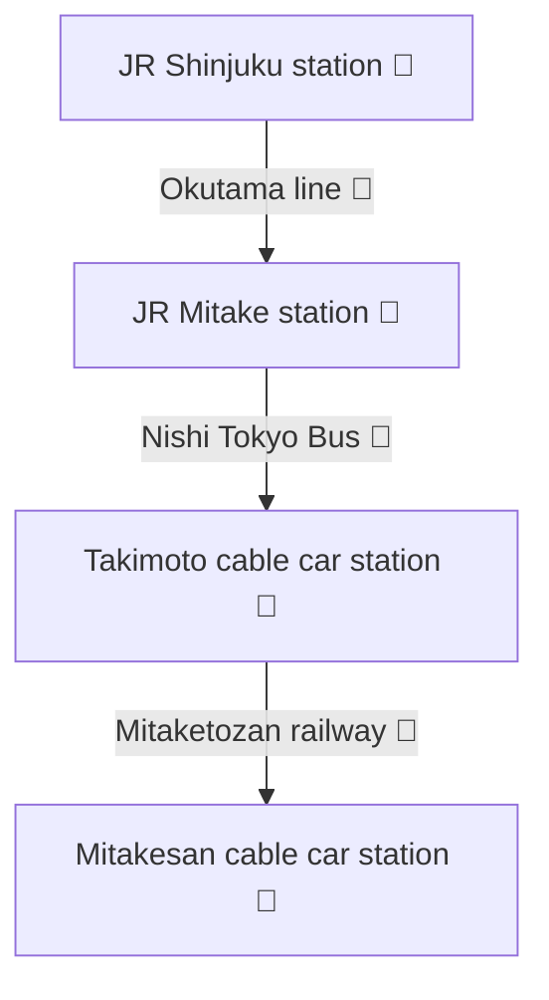

<!-- markdownlint-disable MD041-->

## Mitakesan cable car

Mountain top station: [Mitakesan Cable Car Station / 御岳山駅][mitakesan-cable-car-sta]

Base station: [Takimoto Station / 滝本駅][takimoto-sta]

Closest train station: [JR Mitake Station / 御嶽駅][mitake-sta]

* Take a bus from JR Mitake Station to Takimoto Station.

JR Mitake Station to Mitakesan Cable Car Station route map:  
![JR Mitake Station to Mitakesan Cable Car Station route map][img-mitake-mitakesan]

Phone numbers:

* Mitake Tozan Railway: [0428-78-8121][0428-78-8121]
* Nishi Tokyo Bus (Haigawa Office): [0428-83-2126][0428-83-2126]

Cost:

* 1,200 yen round trip (adult)
* 600 yen one way (adult)

### Mitakesan cable car timetables

> [!WARNING] 🚠 The last cable car down from Mt. Mitake is at 18:30. ⚠️

| Hour | Weekdays   | Weekends and holidays |
| ---: | ---------- | --------------------- |
|   07 | 30, 55     | 30, 54                |
|   08 | 20, 40     | 10, 26, 42, 58        |
|   09 | 00, 20, 40 | 14, 30, 46            |
|   10 | 00, 20, 40 | 02, 18, 42, 58        |
|   11 | 10, 45     | 14, 46                |
|   12 | 10, 40     | 02, 18, 42            |
|   13 | 10, 40     | 14, 46                |
|   14 | 10, 42     | 18, 50                |
|   15 | 00, 20, 42 | 06, 22, 38, 54        |
|   16 | 06, 30     | 10, 34, 58            |
|   17 | 00, 30     | 30                    |
|   18 | 00, 30     | 00, 30                |

* Timetable as of 2025-10-11.
* For more details, see [mitaketozan.co.jp/timetable.html][mitaketozan-timetable].

<!-- Links -->

[0428-78-8121]: tel:+810428788121
[0428-83-2126]: tel:+810428832126
[mitake-sta]: https://maps.app.goo.gl/SQbr1D3ey8Rhg6819
[mitakesan-cable-car-sta]: https://goo.gl/maps/W7baocnkbqSZ1iDZ7
[mitaketozan-timetable]: https://www.mitaketozan.co.jp/timetable.html
[takimoto-sta]: https://maps.app.goo.gl/om1N7HyGpp6Y71pE8

<!-- Image links -->

[img-mitake-mitakesan]: /mitake-station-to-mitakesan.png
